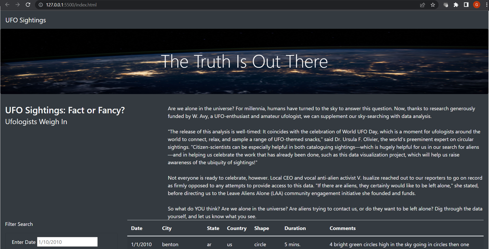
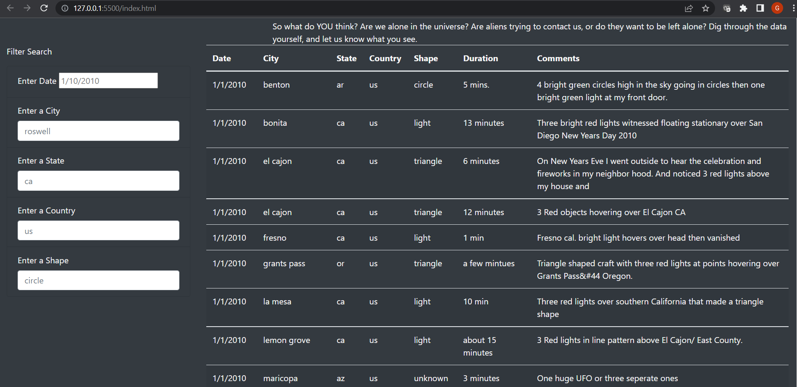
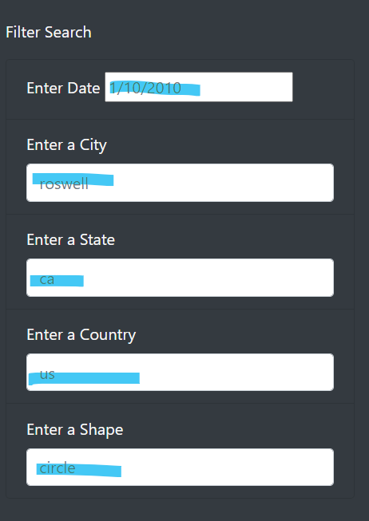
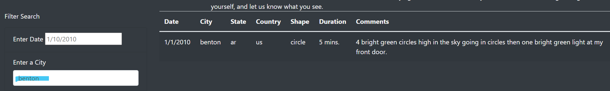

# UFOs

## Overview of Project

* Explore UFO data (Date/City/State/Country/Shape/Duration/Comments) by gathering the data and put it all into a visualization as outlined below.

* Build a table using data stored in a JavaScript array.
* Create filters to make this table fully dynamic, meaning that it will react to user input, and  then place the table into an HTML file for easy viewing.
* Customize the webpage using Bootstrap, and equip the table with several fully functional filters that will allow users to interact with our visualizations. 

## Results 

### How to search / filter

1. Manuever to filters on the left hand side of the webpage.

2. Choose filter to use, start typing over informaiton defaulted in filter box, in this exmaple, benton was typed in the city filed and mouse was clicked once to slect, data filted on the chart to the right.  As a note, filters are case sensitive, please use benton, instead of Benton, this is true of all the filters.

## Summary

### One drawback of this new design 

In conclusion, one drawback of this newly designed page is that there is no explanation on the webpage on how to filter the information.  It is not intuitive enought to start typing in any of the filter boxes presented as it defaults to information already listed.  It's confusing to the end user.  

### Recommendations for improvement and futher development

1. First recommendation would be to make the data scrape from something that is live so it's not static and dated.  The current format limits the end user to the timeframe and data listed.

2. Additionally, updates to the search function are recommendated, currently, information for filters needs to be typed exactly as they are in the data, case sensitivity, date format.  Again, making the experience difficult for the end user.

3. If a live scrape could be made of the data, then more metrics could be added as well as visualizations such as sightings over time, or grouped by states etc.
